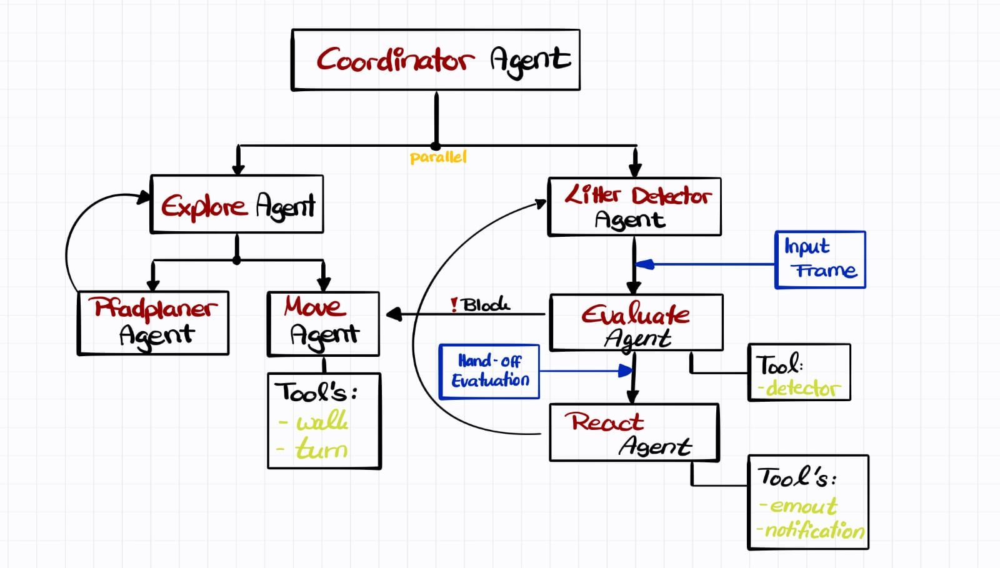

# Agents Aufbau
Hier sollen die Überlegungen und Definitionen dokumentiert werden, die für die Aufgabe in Betracht gezogen werden. Bezogen wird sich hier auf die Aufgabenstellung aus [dem Arbeitspaket für Labor 2](../../docs/student_task_2.md).

## Aufgaben:
1. [x] Legen Sie fest, welche Agenten Sie benötigen, und definieren Sie die Aufgaben, die diese ausführen sollen. 
2. [] Legen Sie die Verbindung zwischen Roboter und Agenten fest.
3. [] Überlegen Sie sich, welche parallelen Aufgaben möglicherweise aktiv sind, welche Bewegungsmuster erforderlich sind, wie der Roboter gestartet und gestoppt wird und wie die Interaktion mit einem Menschen aussehen soll.
4. [] Recherchieren Sie Lösungen, um Ihre Funktionalität zu erreichen (z. B. Sprachverarbeitung).
5. [] Integrieren Sie den Roboter in Ihr Agentensystem.

Fragen, die Sie sich stellen könnten:

- Welche Komponente sollte das Szenario planen?
- Welche Komponente beobachtet die aktuelle Ausführung?
- Wie wird ein Plan dargestellt?

TODO:

- [] Pfadplaner Agent + Doku (Berat) 
- [x] Move Agent + Doku (Marie)
- [] Litter Detector Agent + Doku (Simon)
- [] Evaluate Agent + Doku (Simon)
- [] React Agent + Doku ()
- [] Coordinator Agent + Doku (Simon)
- [] Explore Agent + Doku (Berat)

## Aufgabe 1
### Erste Überlegung:
```
Agent --- Tools
            |--- **Laufen**: Geradeauslaufen von Punkt A nach B.
            |--- **Drehen**: Wenn B erreicht drehen.
            |--- **Scan**: Während des laufens die Umgebung nach Müll Scannen.
                    |------ **Save & Send**: Bei erfolgreicher erkennung, Position speichern & senden.
                    |------ **Emote**: Bewegung & Sound bei erfolgreicher erkennung durchführen.
```

### Update Agent Struktur


### Agents 
**Coordinator Agent**

**Explore Agent**

**Path-Plan Agent**

**Move Agent**
Dieser Agent ist für die Bewegung zu den Zielkoordinaten zuständig, die er vom Explore Agent erhält. Er plant die Zielpunkte nicht selbst, sondern setzt sie in Bewegungsbefehle für den Roboterhund um.

Die drei Haupt-Tools des Move Agents sind `Walk`, `Turn` und `Coordinate`. Das Walk Tool ermöglicht es dem Roboterhund, geradeaus vorwärts oder rückwärts zu laufen. Das Turn Tool erlaubt es ihm, sich um eine bestimmte Anzahl von Grad nach links oder rechts zu drehen. Das Coordinate Tool ermöglicht es dem Roboterhund, eine übergebene Zielkoordinate anzulaufen, indem es die notwendige Drehung und die anschließende Geradeausbewegung berechnet und ausführt.

Zusätzlich ist im Code ein `stop_movement` Tool registriert, das einen Null-Bewegungsbefehl sendet und den Roboter stoppt.

Die dazugehörigen Tools sind in den Dateien [`walk_tool.py`](tools/walk_tool.py), [`turn_tool.py`](tools/turn_tool.py) und [`coordinate_tool.py`](tools/coordinate_tool.py) definiert. In der Datei [`motion_types.py`](tools/motion_types.py) sind die Datentypen definiert, die von den Tools verwendet werden, z. B. Bewegungsbefehle, Roboterposition, Geschwindigkeit, Drehrichtung, Dauer und Tool-Ergebnisse.

**Litter Detection Agent**

**Evaluate Agent**

**React Agent**

## Aufgabe 2
Die Verbindung zwischen Roboter und Agenten erfolgt über die Tools, die in den Agenten definiert sind. Jedes Tool sendet Befehle an den Roboterhund, um bestimmte Aktionen auszuführen, z. B. Laufen, Drehen oder Koordinieren. Die Tools verwenden die in `motion_types.py` definierten Datentypen, um die Befehle zu strukturieren und die Kommunikation zwischen Agenten und Roboter zu erleichtern. Die Agenten rufen die Tools auf, um die gewünschten Bewegungen oder Aktionen auszuführen, und die Tools übersetzen diese in konkrete Befehle, die an den Roboterhund gesendet werden. Die Tools können auch Rückmeldungen vom Roboter erhalten, um die Ausführung zu überwachen und gegebenenfalls Anpassungen vorzunehmen.

## Aufgabe 3
Die parallelen Aufgaben, die möglicherweise aktiv sind, umfassen das gleichzeitige Laufen und Scannen der Umgebung nach Müll. Während der Roboterhund sich bewegt, kann er kontinuierlich die Umgebung mit seinem Kamera Sensor überwachen, um potenziellen Müll zu erkennen. Wenn ein Müll erkannt wird, könnte der Roboterhund sofort eine Reaktion ausführen, z. B. eine Emote-Bewegung, um die Entdeckung zu signalisieren. Gleichzeitig könnte er die Position des Mülls speichern und an den Evaluate Agent senden, um die Informationen weiter zu verarbeiten. Die Interaktion mit einem Menschen könnte durch eine Sprachschnittstelle oder eine visuelle Anzeige erfolgen, die dem Benutzer Informationen über den Fortschritt des Roboters und die Entdeckungen liefert. Der Roboter könnte auch auf Befehle des Benutzers reagieren, z. B. um bestimmte Bereiche zu erkunden oder um Hilfe zu bitten, wenn er auf ein Hindernis stößt.
